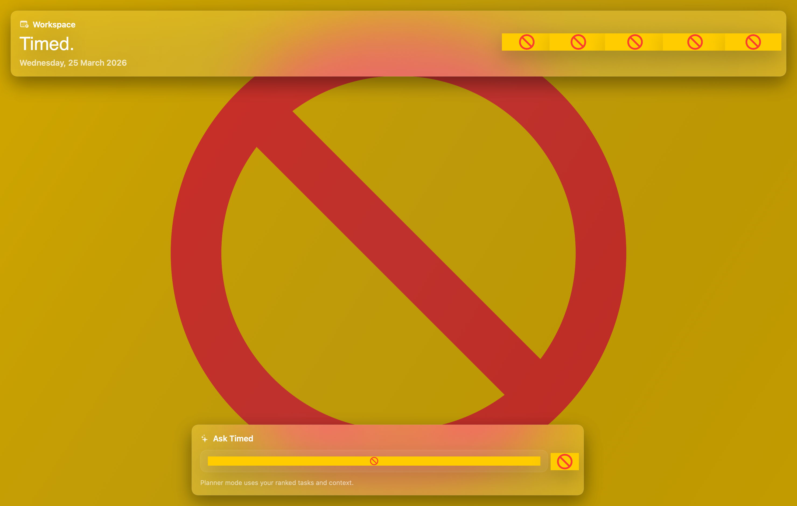

# Timed

[](https://github.com/ammarshah1n/time-manager-desktop/actions/workflows/macos-ci.yml)
[](https://github.com/ammarshah1n/time-manager-desktop/releases/latest)

Timed is a macOS 15 SwiftUI desktop app for turning scattered school work into a ranked, time-boxed study plan.

## Screenshots

### Planner workspace



### Quiz mode


### AI settings


## What it does

- Imports school work from Seqta-style pasted text.
- Imports TickTick pasted lists and TickTick CSV exports.
- Stores context from transcripts, notes, and chat.
- Ranks tasks by deadline pressure, importance, confidence gap, subject pressure, recent context, and prompt intent.
- Builds a capped next-3-hours schedule with approval controls.
- Uses the local Codex CLI as a study-planning and quiz backend.
- Exports approved study blocks to Apple Calendar, with ICS fallback if calendar permission is denied.

## Product docs

- Spec: [PRD.md](./PRD.md)
- Repo rules: [AGENTS.md](./AGENTS.md)
- First-run onboarding: [docs/ONBOARDING.md](./docs/ONBOARDING.md)
- Install guide: [docs/INSTALL.md](./docs/INSTALL.md)
- UI map: [docs/UI_OVERVIEW.md](./docs/UI_OVERVIEW.md)
- Acceptance matrix: [docs/ACCEPTANCE.md](./docs/ACCEPTANCE.md)
- Validation log: [docs/VALIDATION.md](./docs/VALIDATION.md)
- Architecture: [docs/ARCHITECTURE.md](./docs/ARCHITECTURE.md)

## Local development

```bash
swift build -c release
swift test
bash scripts/render_screenshots.sh
bash scripts/package_app.sh
bash scripts/install_app.sh
bash scripts/notarize_app.sh # requires Apple notary credentials
```

## Release install

1. Download the latest `timed.app.zip` from Releases.
2. Unzip it.
3. Move `timed.app` into `/Applications`.
4. Launch `Timed`.

The app is ad-hoc signed in the packaging step.

For wider distribution, use the notarization path in [`scripts/notarize_app.sh`](./scripts/notarize_app.sh) and ship the stapled app bundle or zipped release artifact.

## Architecture

- UI: SwiftUI + AppKit window blur bridge
- Local persistence: `PlannerStore`
- Ranking: `PlanningEngine`
- Imports: `ImportPipeline`
- AI bridge: `CodexBridge`
- Calendar export: `CalendarExporter`

## Trust boundary

- Timed does not embed a cloud LLM SDK.
- All AI actions route through the local Codex CLI path configured in `Settings`.
- Imported tasks, context, and chat stay in the local planner snapshot unless the user installs a Codex CLI backend that sends prompts elsewhere.
- Review the Codex executable you point Timed at. The app trusts that local executable to answer planner and quiz prompts.

## Key files

- [`Sources/ContentView.swift`](./Sources/ContentView.swift)
- [`Sources/PlannerStore.swift`](./Sources/PlannerStore.swift)
- [`Sources/PlanningEngine.swift`](./Sources/PlanningEngine.swift)
- [`Sources/CodexBridge.swift`](./Sources/CodexBridge.swift)
- [`Sources/ImportPipeline.swift`](./Sources/ImportPipeline.swift)
- [`Tests/PlanningEngineTests.swift`](./Tests/PlanningEngineTests.swift)

## CI

GitHub Actions runs:

- Release build
- Test suite
- App packaging

## Current status

- Desktop app shell: done
- Ranked planning workflow: done
- Quiz mode: done
- Calendar export: done
- Packaging scripts: done
- CI: done
- Onboarding docs: done

## Prompt-to-code coverage

- UI rebuild and shared card system: [`Sources/ContentView.swift`](./Sources/ContentView.swift), [`Sources/TimedCard.swift`](./Sources/TimedCard.swift), [`Sources/VisualEffectView.swift`](./Sources/VisualEffectView.swift)
- Codex study-planner bridge and quiz prompts: [`Sources/CodexBridge.swift`](./Sources/CodexBridge.swift), [`Sources/PlannerStore.swift`](./Sources/PlannerStore.swift)
- Import parsing, subject inference, and dedupe: [`Sources/ImportPipeline.swift`](./Sources/ImportPipeline.swift), [`Sources/Models.swift`](./Sources/Models.swift)
- Ranking and scheduling: [`Sources/PlanningEngine.swift`](./Sources/PlanningEngine.swift)
- Calendar export and ICS fallback: [`Sources/CalendarExporter.swift`](./Sources/CalendarExporter.swift)
- Regression coverage: [`Tests/PlanningEngineTests.swift`](./Tests/PlanningEngineTests.swift)

## Roadmap

- Add deeper Seqta parsing and import previews.
- Add smarter schedule feedback loops and revision tracking.
- Add richer revision-history insight after each completed block.
